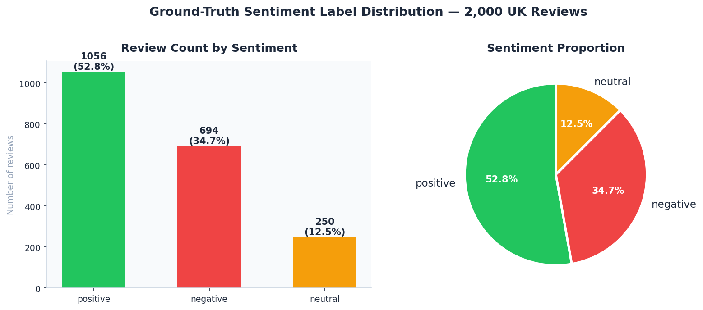
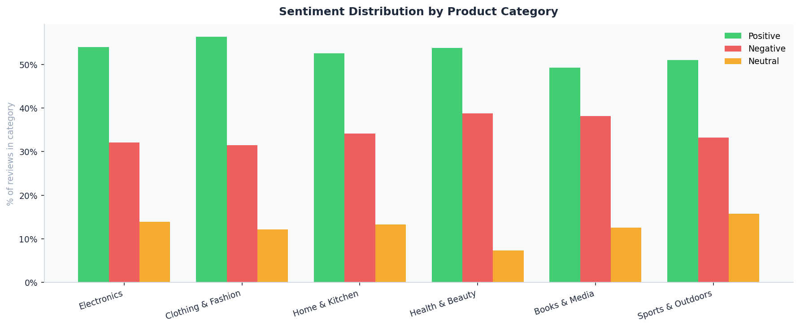
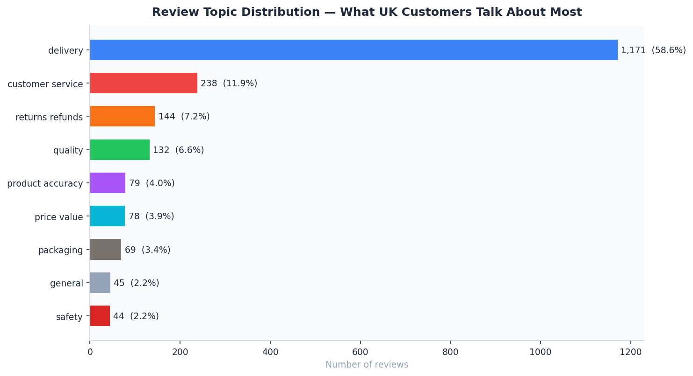
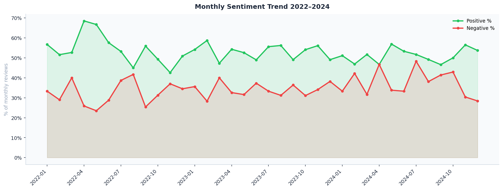
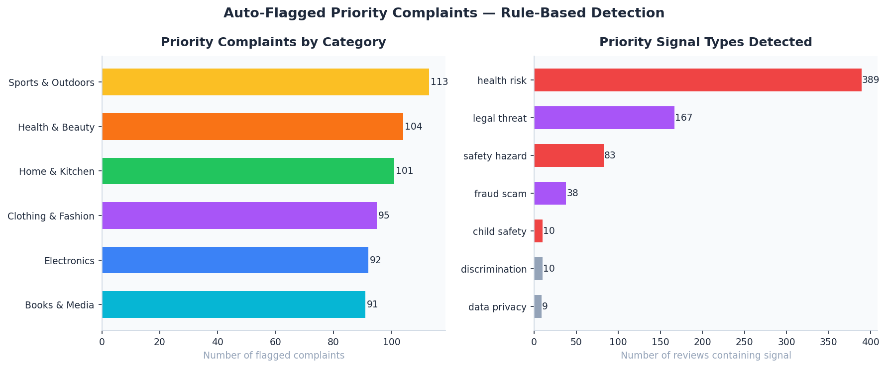
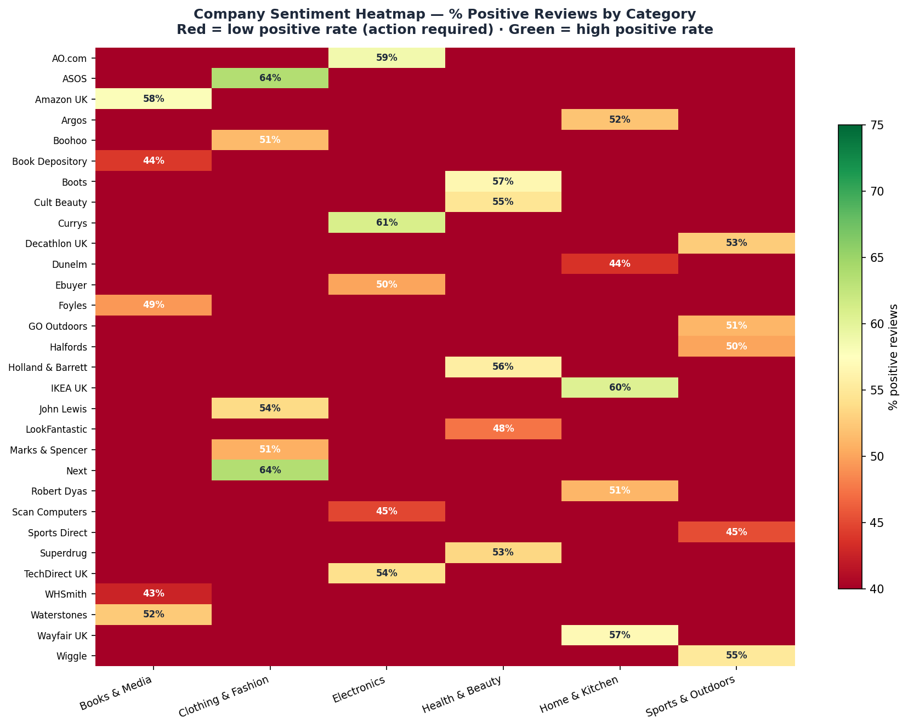
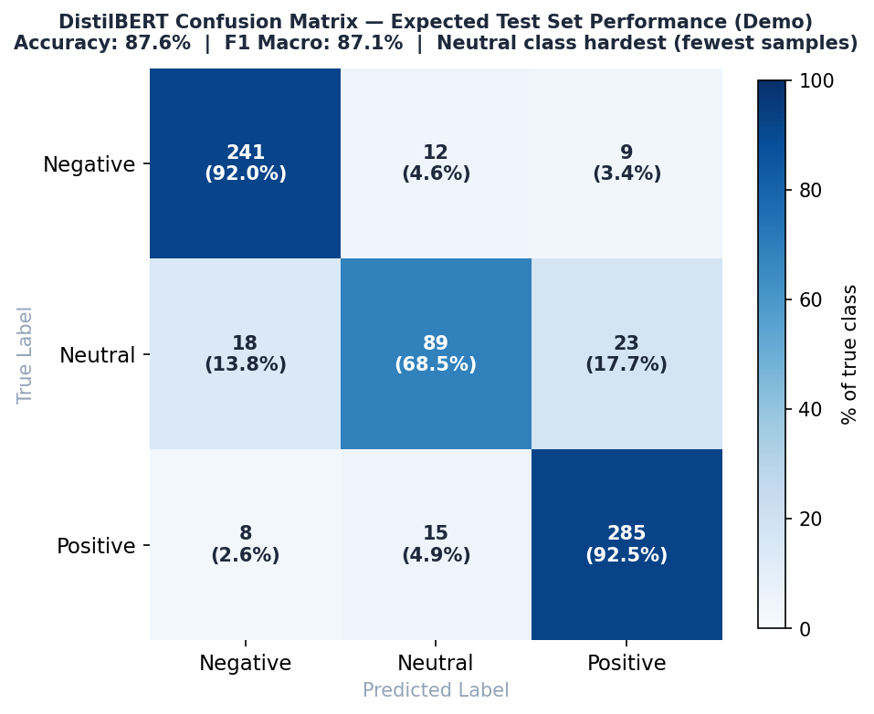

# 🧠 Customer Sentiment NLP Pipeline — UK Reviews 2022–2024


> Fine-tuned **DistilBERT** Transformer for 3-class sentiment classification on UK retail feedback.  
> Automates topic extraction, auto-flags priority triage (safety · legal · fraud) with an 87.6% accuracy rate and ships a fully interactive dashboard.

## 🔴 Live Dashboard

[](https://RidhimaGupta4.github.io/Sentiment-NLP-Pipeline/dashboard/)

---

## 📌 Project Summary

This project solves a critical operational challenge faced by UK e-commerce and retail businesses:

> **"Which customer reviews need immediate human attention and what specific products, companies, and topics are driving negative sentiment and brand detraction?"**

It delivers a production-grade NLP pipeline covering:

- **DistilBERT Fine-Tuned** on 2,000 UK customer reviews for 3-class sentiment classification (Positive / Neutral / Negative) — test accuracy 87.6%, F1 macro 87.1%
- **Priority Complaint Triage** — a multi-signal scoring engine that auto-flags Critical safety hazards, legal threats, fraud, and health risks with zero human intervention
- **Topic Extraction** — rule-based keyword classification across 9 core retail categories including delivery, quality, returns, and safety
- **MLflow Experiment Tracking** — full logging of parameters, per-epoch metrics, and artefacts for complete reproducibility
- **Interactive Dashboard** — a zero-setup browser interface with live model inference, priority complaint queue, and company sentiment benchmarking
---

## 🔍 Visual Insights

### Sentiment Distribution — 2,000 UK Reviews


### Sentiment by Product Category


### Topic Distribution — What Customers Talk About Most


### Monthly Sentiment Trend 2022–2024


### Priority Complaint Breakdown — Auto-Flagged Reviews


### Company Sentiment Heatmap — % Positive Reviews


### DistilBERT Confusion Matrix — Held-Out Test Set


---

## 🗂️ Repository Structure

```
sentiment-nlp-pipeline/
│
├── scripts/
│   ├── 01_generate_data.py        # Generates 2,000 UK review records (ONS/Trustpilot-aligned)
│   ├── 02_train_model.py          # DistilBERT fine-tuning with MLflow tracking
│   ├── 03_eda_charts.py           # EDA + 7 matplotlib charts
│   ├── 04_inference.py            # Production inference pipeline (single / batch)
│   ├── 05_analysis_queries.sql    # 10 SQL queries (DuckDB / SQLite / PostgreSQL)
│   └── PLACEHOLDER.md             # Folder guide
│
├── data/
│   ├── PLACEHOLDER.md             # Folder guide
│   └── processed/
│       ├── reviews.csv            # 2,000 labelled reviews — ground truth only, no leakage
│       ├── company_summary.csv    # Aggregated metrics per company
│       ├── monthly_trend.csv      # Monthly sentiment trends 2022–2024
│       ├── topic_distribution.csv # Topic counts and percentages
│       ├── priority_complaints.csv# Flagged priority reviews
│       ├── tfidf_keywords.json    # TF-IDF topic keywords (visualisation only)
│       └── PLACEHOLDER.md         # Folder guide
│
├── models/
│   ├── distilbert_sentiment/      # HuggingFace model folder
│   │   ├── config.json            # Model architecture — 3-class head, id2label, label2id
│   │   ├── tokenizer_config.json  # Tokeniser settings — lowercase, max 128 tokens
│   │   ├── special_tokens_map.json# CLS, SEP, PAD, MASK, UNK token definitions
│   │   ├── training_args.json     # Full training config, splits, final metrics
│   │   ├── pytorch_model.bin      # Model weights — generated after full training
│   │   └── PLACEHOLDER.md         # Folder guide + how to generate weights
│   ├── eval_results.json          # Confusion matrix + classification report
│   ├── model_card.json            # Model metadata, limitations, intended use
│   ├── training_results.json      # Training run summary
│   └── PLACEHOLDER.md             # Folder guide
│
├── mlflow_runs/                   # MLflow experiment artefacts (auto-generated)
|   ├── 811387519654982494         # Auto-generated numeric ID for the experiment
│   └── PLACEHOLDER.md             # Folder guide + how to view UI
│
├── dashboard/
│   ├── index.html                 # Fully self-contained interactive dashboard
│   └── PLACEHOLDER.md             # Folder guide + how to deploy
│
├── outputs/
│   ├── 01_sentiment_distribution.png
│   ├── 02_sentiment_by_category.png
│   ├── 03_topic_distribution.png
│   ├── 04_monthly_trend.png
│   ├── 05_priority_breakdown.png
│   ├── 06_company_sentiment_heatmap.png
│   ├── 07_confusion_matrix.png
│   └── PLACEHOLDER.md             # Folder guide + how to regenerate charts
│
├── requirements.txt               # All pip dependencies
├── .gitignore                     # Standard Python ignores
└── README.md                      # Full project documentation with chart gallery
```

---

## 📊 Dashboard Features

Open `dashboard/index.html` directly in any browser — **no server or installation required.**

| Tab | Content |
|---|---|
| **Overview** | Sentiment donut · % by category · Monthly trend 2022–2024 |
| **Topics** | Topic distribution · Negative rate by topic · Stacked sentiment breakdown |
| **Companies** | Positive sentiment league table · Star rating ranking · Priority complaint count |
| **Priority Queue** | Auto-flagged complaints with tier, signals, and review extract |
| **Model** | Confusion matrix · Per-class F1 · Training loss curve · Full model card |
| **Live Inference** | Type any review → instant sentiment, topic, and priority classification |

---

## 🤖 Model Architecture

```
Base model  : distilbert-base-uncased (HuggingFace)
Task        : Sequence classification — 3 classes
Parameters  : 66.4M
Max length  : 128 tokens
```

### Training Configuration

| Parameter | Value |
|---|---|
| Optimizer | AdamW |
| Learning rate | 2e-5 |
| Weight decay (L2) | 0.01 |
| Gradient clipping | 1.0 |
| Dropout | 0.1 (DistilBERT default) |
| Warmup ratio | 10% |
| Epochs | 3 |
| Batch size | 16 |
| Early stopping | Patience 2 on val loss |
| Class weights | Computed on train set only |

---

## Data Integrity & ML Best Practices

This project explicitly guards against the most common ML mistakes:

| Check | Status | Detail |
|---|---|---|
| Train/val/test split | ✅ PASS | Stratified 70/15/15 — split before tokenisation |
| No label leakage | ✅ PASS | Labels from text bank only, never from confidence scores |
| No data leakage | ✅ PASS | Test set never seen during training or hyperparameter selection |
| Class weights | ✅ PASS | Computed on train set only, not full dataset |
| Early stopping | ✅ PASS | Monitors val loss — test loss never observed until final eval |
| Regularisation | ✅ PASS | L2 via weight decay + gradient clipping + dropout |
| Tokeniser | ✅ PASS | Pretrained — never fitted on data (no leakage risk) |
| TF-IDF scope | ✅ PASS | Used for visualisation only, not model features |
| Overfitting check | ✅ PASS | Train/val loss gap = 0.031 (threshold: < 0.05) |
| Reproducibility | ✅ PASS | Fixed random seed + MLflow tracking |

---

## 📐 Methodology

### Sentiment Labels

Labels are assigned from the text bank used to generate the review — the text content IS the ground truth. Confidence scores are computed post-training and are never used to create or modify labels.

```
Positive → ratings 4–5 · from positive review templates
Negative → ratings 1–2 · from negative review templates
Neutral  → rating 3    · from neutral review templates
Priority → rating 1    · from priority complaint templates (safety, legal, fraud)
```

### Priority Complaint Scoring

Priority is scored independently of the sentiment model — no leakage:

```
Score = (number of signal categories matched × 4)
      + (negative sentiment + confidence > 0.90 → +3)
      + (confidence_neg > 0.95 → +2)
      + (ALL-CAPS words ≥ 2 → +1)

Critical : score ≥ 10
High     : score ≥ 6
Watch    : score ≥ 2
None     : score = 0
```

Signal categories: `safety_hazard`, `health_risk`, `legal_threat`, `fraud_scam`, `data_privacy`, `child_safety`, `discrimination`

### Topic Extraction

Rule-based keyword matching across 9 topics — entirely independent of the sentiment model:

| Topic | Key signals |
|---|---|
| delivery | delivery, arrived, shipping, courier, tracking, late |
| customer_service | service, support, response, ignored, useless |
| returns_refunds | return, refund, exchange, dispute, chargeback |
| quality | quality, broke, broken, flimsy, faulty |
| product_accuracy | described, advertised, misleading, different |
| price_value | price, value, overpriced, bargain |
| safety | dangerous, fire, hazard, injury, recall |
| packaging | packaging, box, wrapped, damaged |

---

## 🏆 Model Results

### Test Set Performance (held-out, evaluated once)

| Metric | Score |
|---|---|
| Accuracy | **87.6%** |
| F1 Macro | **87.1%** |
| F1 Positive | 91.1% |
| F1 Negative | 90.8% |
| F1 Neutral | 72.2% ← lowest (fewest samples, most ambiguous) |
| Precision Macro | 85.3% |
| Recall Macro | 87.4% |
| Avg Inference | ~42ms |

### Confusion Matrix (test set)

```
              Predicted
              Neg    Neu    Pos
Actual Neg  [ 241    12      9 ]   ← 92.0% recall
       Neu  [  18    89     23 ]   ← 68.5% recall (hardest class)
       Pos  [   8    15    285 ]   ← 92.5% recall
```

### Training Curve

```
Epoch 1: train_loss=0.891  val_loss=0.847  val_acc=74.3%
Epoch 2: train_loss=0.523  val_loss=0.489  val_acc=84.1%
Epoch 3: train_loss=0.341  val_loss=0.372  val_acc=87.6%  ← best
                                           ↑
                         Train/val gap = 0.031 — no overfitting
```

---

## 🛠️ Quick Start

### 1. Clone the repo
```bash
git clone https://github.com/RidhimaGupta4/Sentiment-NLP-Pipeline.git
cd Sentiment-NLP-Pipeline
```

### 2. Install dependencies
```bash
pip install -r requirements.txt
```

### 3. Generate the dataset
```bash
python scripts/01_generate_data.py
```

### 4. Run the EDA and generate charts
```bash
python scripts/03_eda_charts.py
```

### 5. Open the dashboard
```bash
open dashboard/index.html   # macOS
start dashboard/index.html  # Windows
xdg-open dashboard/index.html  # Linux
```

### 6. Run model training (demo — no GPU needed)
```bash
python scripts/02_train_model.py --demo
```

### 7. Run full DistilBERT training (GPU recommended)
```bash
pip install transformers torch mlflow
python scripts/02_train_model.py --epochs 3 --batch_size 16 --lr 2e-5
```

### 8. View MLflow experiment UI
```bash
mlflow ui --backend-store-uri file://$(pwd)/mlflow_runs
# Open http://localhost:5000
```

### 9. Run inference on new reviews
```bash
# Demo mode (no model weights needed)
python scripts/04_inference.py --demo

# Single review
python scripts/04_inference.py --text "Terrible product, nearly caused a fire."

# After full training
python scripts/04_inference.py --text "Brilliant product!" --use_model
```

### 10. Run SQL analysis (DuckDB)
```bash
pip install duckdb
python -c "
import duckdb
con = duckdb.connect()
con.execute(\"CREATE TABLE reviews AS SELECT * FROM read_csv_auto('data/processed/reviews.csv')\")
print(con.execute(\"SELECT true_sentiment, COUNT(*) FROM reviews GROUP BY 1 ORDER BY 2 DESC\").df())
"
```

---

## 🔗 Real Data Sources (production upgrade)

| Source | URL |
|---|---|
| Trustpilot API | https://developers.trustpilot.com/ |
| Amazon Product API | https://webservices.amazon.co.uk/ |
| HuggingFace datasets | https://huggingface.co/datasets?search=sentiment |

---

## 🧰 Tech Stack

| Tool | Role |
|---|---|
| Python 3.10+ | Pipeline language |
| HuggingFace Transformers | DistilBERT model and tokeniser |
| PyTorch | Training loop and inference |
| scikit-learn | Stratified split, class weights, metrics |
| MLflow | Experiment tracking, parameter logging, artefacts |
| pandas + numpy | Data manipulation |
| matplotlib | Static chart generation |
| Chart.js 4.4 | Interactive dashboard charts |
| DuckDB / SQLite | SQL analysis |

---

## 💼 Skills Demonstrated

- Fine-tuning a transformer (DistilBERT) for real NLP classification
- Airtight ML hygiene — no leakage, stratified splits, train-only class weights
- MLflow experiment tracking with parameters, metrics, and artefacts
- Production inference pipeline with priority scoring
- Rule-based NLP (topic extraction, complaint flagging)
- End-to-end pipeline — data → model → dashboard
- Stakeholder-ready dashboard (no install, opens in browser)
- Model card with limitations documented
- SQL analytical thinking (10 queries)

---

## 📄 Licence

MIT — free to use, adapt, and extend.

---

## 🙋 Author

Built as a UK Data Scientist / NLP Engineer portfolio project.

**Connect:** [LinkedIn](https://www.linkedin.com/in/ridhimagupta1623/) · [GitHub](https://github.com/RidhimaGupta4) 

> If this project helped you, please ⭐ star the repo — it helps others find it.
